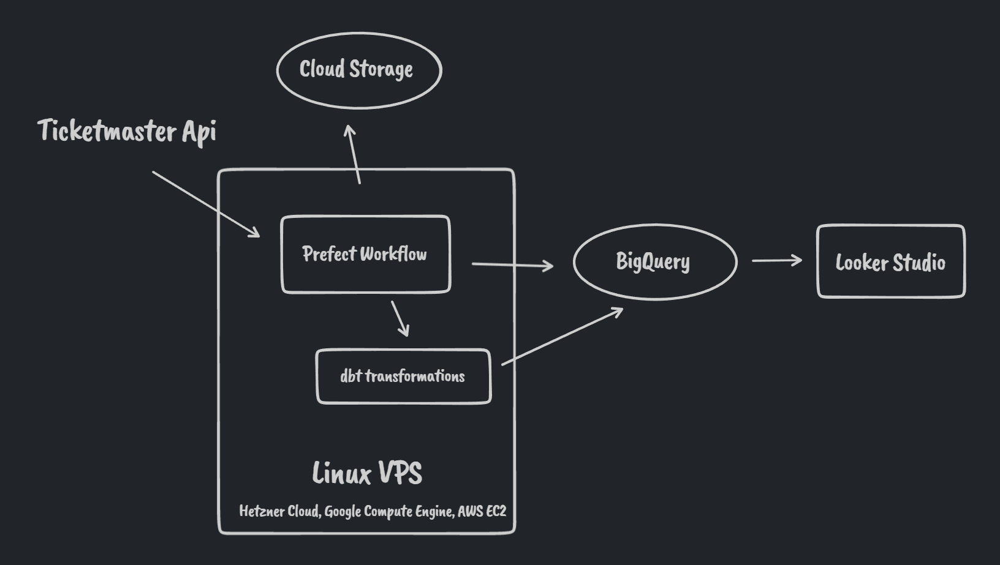
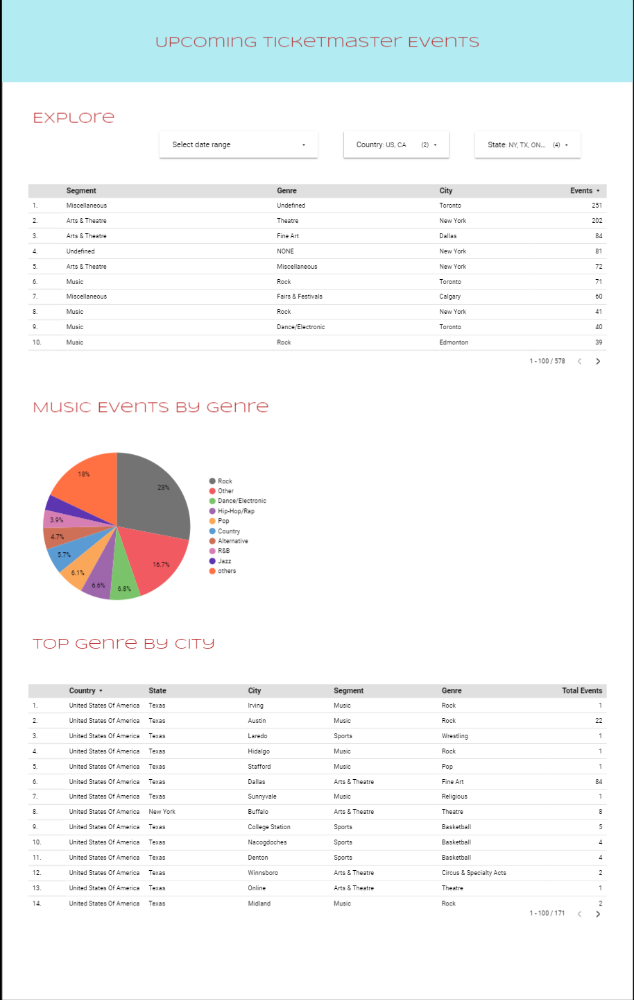

# Capstone Project - Upcoming Ticketmaster Events

## About this project
This project is the capstone project for the [Data Engineering Zoomcamp](https://github.com/DataTalksClub/data-engineering-zoomcamp) course held by [DataTalks.Club](https://datatalks.club/). In this project we apply key technologies learned through the course.

## Problem to solve
Visualize upcoming events data from ticketmaster api. We are going to develop an ETL pipeline to get the next 1000 upcoming events by country and state. Whenever a deployment runs, it updates the data by deleting the previous one and inserting the new data. We will have a dashboard showing some charts about upcoming events.

## Dataset
We will be using [ticketmaster's public api](https://developer.ticketmaster.com/api-explorer/v2/) to search for upcoming events by country and state.

The fields we are currently saving are:
* event_name
* event_tid
* public_sale_start_date_time
* presale
* event_start_utc_date_time
* event_start_local_date
* event_start_local_time
* event_timezone
* segment
* genre
* sub_genre
* promoter
* venue_name
* venue_tid
* venue_timezone
* venue_city_name
* venue_state_name
* venue_state_code
* venue_country_name
* venue_country_code
* number_of_attractions

## Key Technologies
The following services, frameworks and libraries are used:

* [Goougle Cloud Storage](https://cloud.google.com/storage)
* [Google BigQuery](https://cloud.google.com/bigquery)
* [Hetzner Cloud](https://www.hetzner.com/cloud)
* [Prefect](https://www.prefect.io/)
* [Dbt](https://www.getdbt.com/)
* [Terraform](https://www.terraform.io/)

## Project architecture
The end-to-end data pipeline includes the next steps:
* downloading data from the API and saving it to GCS for archival, in case we want to process historical data in the future.
* in the same workflow/deployment, refresh the data in bigquery by deleting where country and state match, and then insert the new data.
* transforming the data in the DWH and preparing it for the dashboard
* dashboard creating/refreshing.



## Setup

### 1. Pre-requisites
Make sure you have the following pre-installed components: 
* [GCP account](https://cloud.google.com/)
* [Terraform](https://www.terraform.io/downloads)
* [Docker](https://docs.docker.com/get-docker/)

### 2. Google Cloud Platform
To set up GCP, please follow the steps below:
1. If you don't have a GCP account, please create a free trial.
2. Setup new project and write down your Project ID.
3. Configure service account to get access to this project and download auth-keys (.json). Please check the service 
account has all the permissions below:
   * Viewer
   * Storage Admin
   * Storage Object Admin
   * BigQuery Admin 
4. Download [SDK](https://cloud.google.com/sdk) for local setup.
5. Set environment variable to point to your downloaded auth-keys:
```bash
export GOOGLE_APPLICATION_CREDENTIALS="<path/to/your/service-account-authkeys>.json"
# Refresh token/session, and verify authentication
gcloud auth application-default login
```
6. Enable the following options under the APIs and services section:
   * [Identity and Access Management (IAM) API](https://console.cloud.google.com/apis/library/iam.googleapis.com)
   * [IAM service account credentials API](https://console.cloud.google.com/apis/library/iamcredentials.googleapis.com)
   * [Compute Engine API](https://console.developers.google.com/apis/api/compute.googleapis.com) (if you are going to use VM instance)

### 3. Terraform
We use Terraform to build and manage GCP infrastructure. Terraform configuration files are located in the [separate folder](terraform). 
There is 1 configuration file: 
* [main.tf](terraform/main.tf) - is a key configuration file consisting of several sections.

[Here](https://github.com/DataTalksClub/data-engineering-zoomcamp/blob/main/week_1_basics_n_setup/1_terraform_gcp/1_terraform_overview.md)
you can find the detailed description of each section.

Now you can use the steps below to generate resources inside the GCP:
1. Move to the [terraform folder](terraform) using bash command `cd`.
2. Run `terraform init` command to initialize the configuration.
3. Use `terraform plan` to match previews local changes against a remote state.
4. Apply changes to the cloud with `terraform apply` command.

> Note: In steps 3 and 4 Terraform may ask you to specify the Project ID. Please use the ID that you noted down 
earlier at the project setup stage.
> 
If you would like to remove your stack from the Cloud, use the `terraform destroy` command.

### 4. Prefect and Dbt
The next steps provide you with the instructions of running Prefect, which will allow you to run the entire 
orchestration, taking into account that you have already set up a GCP account.

#### Setup
* Setup [conda](https://www.anaconda.com/products/distribution) or [virtualenv](https://docs.python.org/3/library/venv.html) with Python 3.9
* After activating the environment, run `pip install -r requirements.txt`
* To use prefect cloud, create an account and workspace following [this quickstart](https://docs.prefect.io/ui/cloud-quickstart/), and authenticate with the following command `prefect cloud login`
* Register the `prefect-gcp` block with `prefect block register -m prefect_gcp`
* Create the following [Prefect Blocks](https://docs.prefect.io/ui/blocks/):
  * Type: `BigQuery Warehouse`, Name: `ticketmaster-events-bq` for connecting to BigQuery
  * Type: `GCP Credentials`, Name: `de-zoomcamp-capstone-sa` with GCP credentials
  * Type: `String`, Name: `de-capstone-dbt-project-dir` string with full path to `/path/to/repo/dbt/ticketmaster`
  * Type: `String`, Name: `de-zoomcamp-gcp-project` string with gcp project name
  * Type: `GCS Bucket`, Name: `ticketmaster-bucket` with Bucket Name created by the terraform script
  * Type: `String`, Name: `ticketmaster-api-key` string with your ticketmaster api key
* Create a [Dbt Profile](https://docs.getdbt.com/docs/get-started/connection-profiles) named `ticketmaster`
* Run first flow `python prefect_flows/event_data_refresh_flows.py`
* Create deployments for scheduling flows using [this quickstart](https://docs.prefect.io/concepts/deployments/), example deployments can be found in `prefect_deployments/`. The following 2 params are required:
  * country: Country code, ex: `CA`
  * state: State code, ex: `ON`
* Start a prefect agent in the background, one easy way to do this is: `nohup prefect agent start -q <deployment_queue_name> &`

### 5. Google Data Studio
The [final dashboard](https://lookerstudio.google.com/reporting/3f07a3b4-a909-4506-80d2-00ad4af6ca5b) includes three charts:
1. A table where you can explore upcoming events by Segment, Genre and City, with the ability to filter by country, state and a date range
2. A pie chart that shows all Music events by genre
3. A table that shows the genre with most events by city

